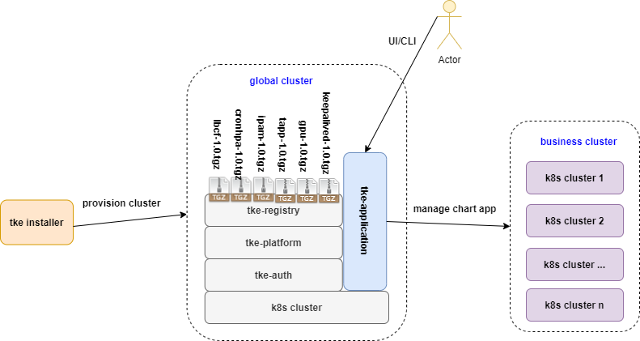

# Tkestack addon framework recap


**Author**: huxiaoliang([@huxiaoliang](https://github.com/huxiaoliang))

**Status** (20201220):  Suspend

## Summary

In order to extend Tkestack functionality so that support more value-add on container cloud platform but don't impact core part too much, Tkestack introduced `addon` framework to address this requirement. There are 2 types of`addon` implementations currently:

1. Manifests based:  there are several sub directory under `manifests` to identity individual `addon` instance,  `tke-platform-api` will use `go-templete` render the yaml files with customized parameter, then apply them to business/target cluster to install:

```
root@dev:~/pkg/platform/provider/baremetal# tree manifests/  
manifests/
├── csi-operator
│   └── csi-operator.yaml
├── gpu
│   └── nvidia-device-plugin.yaml
├── gpu-manager
│   └── gpu-manager.yaml
├── keepalived
│   ├── keepalived.conf
│   └── keepalived.yaml
└── metrics-server
    └── metrics-server.yaml
```

2. Controller based:  There are several individual `controller` inside `tke-platform-controller`in global cluster to watch specified `addon` CR operation,  then leverage `tke-platform-api` access to business/target cluster manage `addon` instance lief cycle.

```
root@dev:~/pkg# tree platform/controller/addon/ -L 1
platform/controller/addon/
├── cronhpa
├── helm
├── ipam
├── lbcf
├── logcollector
├── persistentevent
├── prometheus
├── storage
└── tappcontroller

root@VM-0-77-ubuntu:~# curl -sk -H "Authorization: Bearer $(cat /etc/kubernetes/known_tokens.csv |cut -d "," -f 1)" -H "Content-Type:application/json" https://127.0.0.1:6443/apis/platform.tkestack.io/v1/clusteraddontypes | jq -r .items[].metadata.name
lbcf
helm
persistentevent
logcollector
csioperator
prometheus
ipam
tappcontroller
volumedecorator
cronhpa
```

After `tke-application` enabled, Tkestack will have the ability to use `helm chart` as k8s native approach manage application directly, so `addon` framework should recap according to this new `out-tree` approach, the benefits as bellows:

 - Loose coupled relations between `tke-platform` and individual `addon`: if new addon onboard or old addon update/upgrade, no need rebuild or update core part, individual `addon`chart build and release will out of Tkestack,  no hard dependency for each other
 
 - Unify `addon` life cycle management: `tke-application` will  take the responsibility for managing all `addon` chart include:
   - Create addon xxx               -->  `helm install xxx`
   - Upgrade addon xxx           --> `helm upgrade xxx`
   - Delete addon xxx              -->  `helm delete xxx`
   - Healthy check addon xxx  -->  `helm get xxx`

 - Decouple the process for Tkestack install and upgrade include k8s , tke built-in component and tke addon

 - The `helm hook` mechanism allow chart developers to intervene at certain points in a release's life cycle to support more scenario

 - Better development experience and easily integration for internal developer and community contributor to extend Tkestack functionality

## Scope

 **In-Scope**: 
 1. (**P1**) Porting 2 types of addons to helm chart
 2. (**P1**) Enable `tke-application` by default to manager all addons life cycle include
 3. (**P1**) Label the chart to distinguish system built-in addon chart and other charts
 4. (**P1**) UI support manage addon by call `tke-application-api`rather than `tke-platform-api`

**Out-Of-Scope**: 

 1.  Tkestack built-in component helm chart support

## Limitation


## Main proposal



## Future work


## User case

#### Case 1.  xx


## PR

## Reference
